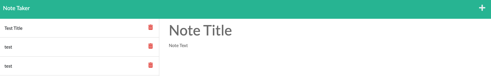

# sturdy-palm-tree

## Note Taker - Challenge Assignment 11 Express.JS

- *What was your motivation?*  I wanted to create a note taker
- *Why did you build this project?*  To show people projects that I have been involved in creating.
- *What problem does it solve?*  It solves me having to write everything down on paper
- *What did I learn?* I learned about express.js, and routing different javascript files using node require. I also learned how to deploy to Heroku. 

## Installation

*What are the steps required to install your project? Provide a step-by-step description of how to get the development environment running.*

Go to https://sturdy-palm-tree.herokuapp.com/ and the page should load and function properly. 

Alternatively, if you wish to download the files then you shoud do the following:
Download all the files, then from your terminal use npm install, then npm start to start the server. Once you have done that you should be able to go to http://localhost:3001/ to use the program locally.

## Usage

*Provide instructions and examples for use. Include screenshots as needed.*

Upon loading the page, you should be click on the button that says Get Started. Once that button is clicked, you should be taken to the Notes page where you can create and view notes.

Below is a screenshot of what the site should look like once you've gotten to the Note Taker. 

## Credits
I used https://devcenter.heroku.com/articles/git to learn how to deploy to Heroku using the command line. I used the activities in this module to figure out how to call different javascript files. 